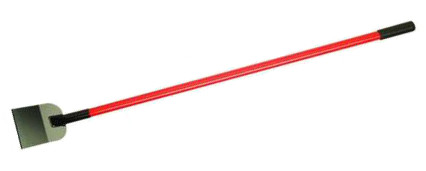

## Tilescraping



A guide for scraping map tiles on the web. The scripts here use [tl](https://github.com/mojodna/tl), a command line utility for tilelive.

### Examples

#### Z/X/Y to MBTiles

Scrape web mercator tiles in the common z/x/y format and store them in MBTiles. Notice the usage of the `-b`, `-z`, and `-Z` arguments to specify the area (bounding box) and min/max zoom levels to scrape.

```bash
npm install -g tl mbtiles tilelive-http
tl copy -z 15 -Z 17 -b '-80.897226 35.636093 -80.881262 35.648578' 'http://tile.openstreetmap.org/{z}/{x}/{y}.png' mbtiles://./tiles.mbtiles
```

A similar pattern uses the [tileify-ags-proxy](https://github.com/JasonSanford/tileify-ags-proxy) to scrape web mercator tiles from a non-cached ArcGIS Server map service.

```bash
tl copy -z 15 -Z 17 -b '-80.897226 35.636093 -80.881262 35.648578' 'http://tileify-ags.herokuapp.com/tiles/{z}/{x}/{y}?url=http%3A%2F%2Fweb2.mobile311.com%2Farcgis%2Frest%2Fservices%2FIredell%2FIredell%2FMapServer&transparent=true&layers=show%3A136' mbtiles://./tiles.mbtiles
```

#### Mapbox Studio to MBTiles

Scrape a vector tiles style and store in MBTiles. This will fail on any styles that utilize Mapbox studio fonts. You can work around this by using custom fonts.

```bash
npm install -g tl mbtiles tilelive-tmstyle tilelive-mapbox
tl copy -z 13 -Z 17 -b '-80.897226 35.636093 -80.881262 35.648578' tmstyle://./pencil.tm2/ mbtiles://./tiles.mbtiles
```
